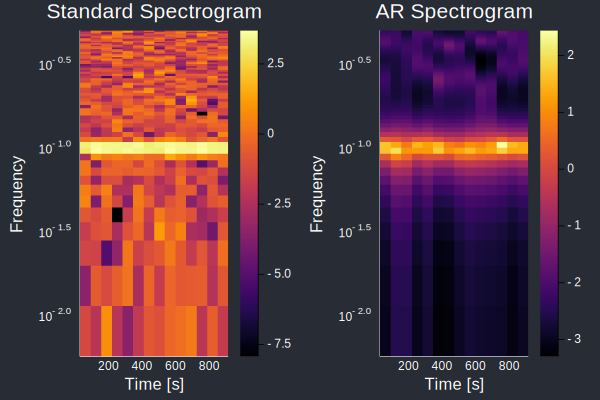
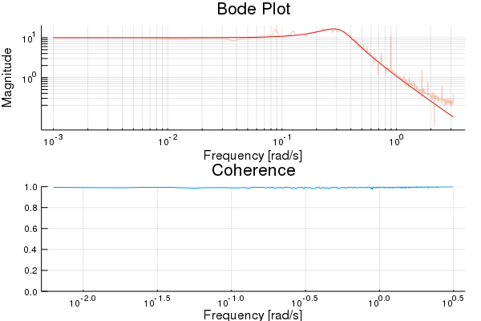
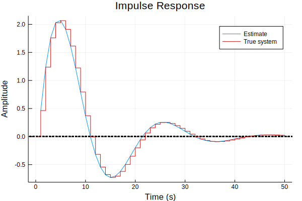
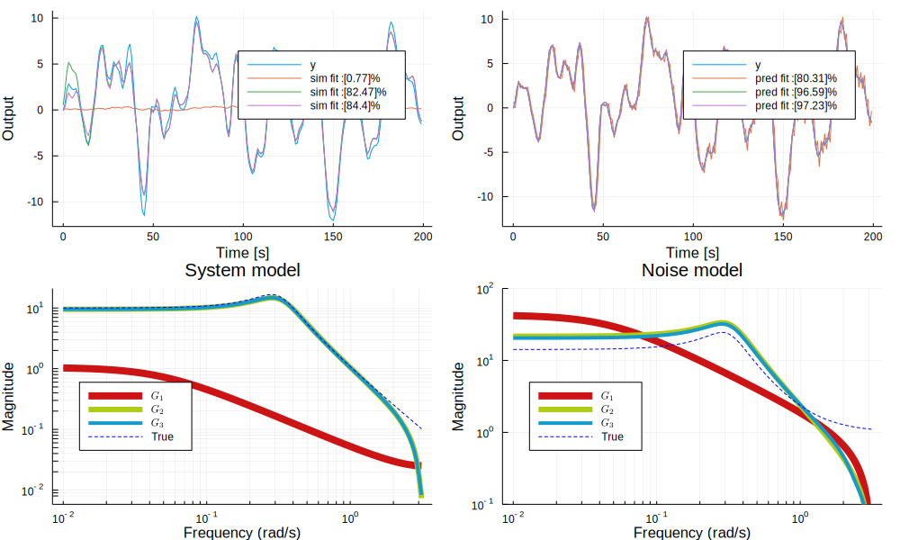

# ControlSystemIdentification

[](https://github.com/baggepinnen/ControlSystemIdentification.jl/actions)
[](https://codecov.io/gh/baggepinnen/ControlSystemIdentification.jl)

System identification for [ControlSystems.jl](https://github.com/JuliaControl/ControlSystems.jl/). Examples in the form of jupyter notebooks are provided [here](
https://github.com/JuliaControl/ControlExamples.jl?files=1).

# LTI state-space models

There exist two methods for identification of statespace models, `n4sid` and `pem`. `n4sid` uses subspace-based identification whereas `pem` solves the prediction-error problem using an iterative optimization method (from Optim.jl). If unsure which method to use, try `n4sid` first.

## Subspace based identification using n4sid
```julia
d = iddata(y,u,sampletime)
sys = n4sid(d, :auto; verbose=false)
# or use a robust version of svd if y has outliers or missing values
using TotalLeastSquares
sys = n4sid(d, :auto; verbose=false, svd=x->rpca(x)[3])
```
Estimate a statespace model using the n4sid method. Returns an object of type `N4SIDResult` where the model is accessed as `sys.sys`.

#### Arguments:
- `d`: Identification data object, created using `iddata(y,u,sampletime)`.
- `y`: Measurements N×ny
- `u`: Control signal N×nu
- `r`: Rank of the model (model order)
- `verbose`: Print stuff?
- `Wf`: A frequency-domain model of measurement disturbances. To focus the attention of the model on a narrow frequency band, try something like `Wf = Bandstop(lower, upper, fs=1/Ts)` to indicate that there are disturbances *outside* this band.
- `i`: Algorithm parameter, generally no need to tune this
- `γ`: Set this to a value between (0,1) to stabilize unstable models such that the largest eigenvalue has magnitude γ.

The frequency weighting is borrowing ideas from
*"Frequency Weighted Subspace Based System Identification in the Frequency Domain", Tomas McKelvey 1996*. In particular, we apply the output frequency weight matrix (Fy) as it appears in eqs. (16)-(18).

### ERA and OKID
See
```julia
sys = era(d::AbstractIdData, r, m = 2r, n = 2r, l = 5r)
H   = okid(d::AbstractIdData, r, l = 5r)
```

### Filtering and simulation
Models can be simulated using `lsim` from ControlSystems.jl and using `simulate`. You may also convert the model to a `KalmanFilter` from [LowLevelParticleFilters.jl](https://github.com/baggepinnen/LowLevelParticleFilters.jl) by calling `KalmanFilter(sys)`, after which you can perform filtering and smoothing etc. with the utilities provided for a `KalmanFilter`.


## PEM
A simple algorithm for identification of discrete-time LTI systems on state-space form:
```math
x' = Ax + Bu + Ke
y  = Cx + e
```
is provided. The user can choose to minimize either prediction errors or simulation errors, with arbitrary metrics, i.e., not limited to squared errors.

The result of the identification is a custom type `StateSpaceNoise <: ControlSystems.LTISystem`, with fields `A,B,K`, representing the dynamics matrix, input matrix and Kalman gain matrix, respectively. The observation matrix `C` is not stored, as this is always given by `[I 0]` (you can still access it through `sys.C` thanks to `getproperty`).

This package also supports estimating models on the form
```math
Ay = Bu + Cw
```
through pseudo-linear regression or
```math
Ay = Bu + 1/D w
```
through the generalized least squares method (`arxar`).
Estimation of the more general model form
```math
Ay = B/F u + C/D w
```
or any of its other special cases is not supported. Since those models are also LTI systems, estimating a state-space model is in some sense equivalent.

Transfer-function estimation through spectral methods is supported through the functions `tfest` and `coherence`.

### Usage example
Below, we generate a system and simulate it forward in time. We then try to estimate a model based on the input and output sequences.
```julia
using ControlSystemIdentification, ControlSystems, Random, LinearAlgebra

function ⟂(x)
    u,s,v = svd(x)
    u*v
end
function generate_system(nx,ny,nu)
    U,S  = ⟂(randn(nx,nx)), diagm(0=>0.2 .+ 0.5rand(nx))
    A    = S*U
    B   = randn(nx,nu)
    C   = randn(ny,nx)
    sys = ss(A,B,C,0,1)
end

Random.seed!(1)
T   = 1000                      # Number of time steps
nx  = 3                         # Number of poles in the true system
nu  = 1                         # Number of control inputs
ny  = 1                         # Number of outputs
x0  = randn(nx)                 # Initial state
sim(sys,u,x0=x0) = lsim(sys, u', 1:T, x0=x0)[1]' # Helper function
sys = generate_system(nx,nu,ny)
u   = randn(nu,T)               # Generate random input
y   = sim(sys, u, x0)           # Simulate system
d   = iddata(y,u,1)

sysh,x0h,opt = pem(d, nx=nx, focus=:prediction) # Estimate model

yh = predict(sysh, d, x0h)      # Predict using estimated model
plot([y; yh]', lab=["y" "ŷ"])   # Plot prediction and true output
```

We can also simulate the system with colored noise, necessitating estimating also noise models.
```julia
σu = 0.1 # Noise variances
σy = 0.1

sysn = generate_system(nx,nu,ny)             # Noise system
un   = u + sim(sysn, σu*randn(size(u)),0*x0) # Input + load disturbance
y    = sim(sys, un, x0)
yn   = y + sim(sysn, σy*randn(size(u)),0*x0) # Output + measurement noise
dn   = iddata(yn,un,1)
```
The system now has `3nx` poles, `nx` for the system dynamics, and `nx` for each noise model, we indicated this to the main estimation function `pem`:
```julia
sysh,x0h,opt = pem(dn,nx=3nx, focus=:prediction)
yh           = predict(sysh, dn, x0h) # Form prediction
plot([y; yh]', lab=["y" "ŷ"])             # Compare true output (without noise) to prediction
```

We can have a look at the singular values of a balanced system Gramian:
```julia
s    = ss(sysh)   # Convert to standard state-space type
s2,G = balreal(s) # Form balanced representation (obs. and ctrb. Gramians are the same
diag(G)           # Singular values of Gramians

# 9-element Array{Float64,1}:
#  3.5972307807882844
#  0.19777167699663994
#  0.0622528285731599
#  0.004322765397504325
#  0.004270259700592557
#  0.003243449461350837
#  0.003150873301312319
#  0.0005827927965893053
#  0.00029732262107216666
```
Note that there are 3 big singular values, corresponding to the system poles, there are also 2×3 smaller singular values, corresponding to the noise dynamics.

The estimated noise model can be extracted by `noise_model(sys)`, we can visualize it with a bodeplot.
```julia
bodeplot(noise_model(sysh), exp10.(range(-3, stop=0, length=200)), title="Estimated noise dynamics")
```
See the [example notebooks](
https://github.com/JuliaControl/ControlExamples.jl?files=1) for these plots.

### Call signature
`sys, x0, opt = pem(d; nx, kwargs...)`
#### Arguments:
- `d`: Identification data object, created using `iddata(y, u sampletime)`
    - `y`: Measurements, either a matrix with time along dim 2, or a vector of vectors
    - `u`: Control signals, same structure as `y`
- `nx`: Number of poles in the estimated system. This number should be chosen as number of system poles plus number of poles in noise models for measurement noise and load disturbances.
- `focus`: Either `:prediction` or `:simulation`. If `:simulation` is chosen, a two stage problem is solved with prediction focus first, followed by a refinement for simulation focus.
- `metric`: A Function determining how the size of the residuals is measured, default `sse` (e'e), but any Function such as `norm`, `e->sum(abs,e)` or `e -> e'Q*e` could be used.
- `regularizer(p) = 0`: function for regularization of the parameter vector `p`. The structure of `p` is detailed below. L₂ regularization, for instance, can be achieved by `regularizer = p->sum(abs2, p)`
- `solver` Defaults to `Optim.BFGS()`
- `kwargs`: additional keyword arguments are sent to [`Optim.Options`](http://julianlsolvers.github.io/Optim.jl/stable/#user/config/).

#### Structure of parameter vector `p`
The parameter vector is of type [`ComponentVector`](https://github.com/jonniedie/ComponentArrays.jl) and the fields `A,B,K,x0` can be accessed as `p.A` etc. The internal storage is according to
```julia
A  = size(nx,nx)
B  = size(nx,nu)
K  = size(nx,ny)
x0 = size(nx)
p  = [A[:];B[:];K[:];x0]
```

### Return values
- `sys::StateSpaceNoise`: identified system. Can be converted to `StateSpace` by `convert(StateSpace, sys)` or `ss(sys)`, but this will discard the Kalman gain matrix, see `innovation_form`.
- `x0`: Estimated initial state
- `opt`: Optimization problem structure. Contains info of the result of the optimization problem

### Functions
- `pem`: Main estimation function, see above.
- `predict(sys, d, x0=zeros)`: Form predictions using estimated `sys`, this essentially runs a stationary Kalman filter.
- `simulate(sys, u, x0=zeros)`: Simulate the system using input `u`. The noise model and Kalman gain does not have any influence on the simulated output.
- `innovation_form`: Extract the noise model from the estimated system (`ss(A,K,C,0)`).


### Internals
Internally, [Optim.jl](https://github.com/JuliaNLSolvers/Optim.jl) is used to optimize the system parameters, using automatic differentiation to calculate gradients (and Hessians where applicable). Optim solver options can be controlled by passing keyword arguments to `pem`, and by passing a manually constructed solver object. The default solver is [`BFGS()`](http://julianlsolvers.github.io/Optim.jl/stable/#algo/lbfgs/)


# ARX and PLR estimation
Basic support for ARX/ARMAX model estimation, i.e. a model on any of the forms
```math
Ay = Bu + w
Ay = Bu + Cw
Ay = Bu + 1/D w
```
is provided. The ARX estimation problem is convex and the solution is available on closed-form.
Usage example:
```julia
N  = 2000     # Number of time steps
t  = 1:N
Δt = 1        # Sample time
u  = randn(N) # A random control input
G  = tf(0.8, [1,-0.9], 1)
y  = lsim(G,u,t)[1][:]
yn = y
d  = iddata(y,u,Δt)

na,nb = 1,1   # Number of polynomial coefficients

Gls = arx(d,na,nb,stochastic=false) # set stochastic to true to get a transfer function of MonteCarloMeasurements.Particles
@show Gls
# TransferFunction{ControlSystems.SisoRational{Float64}}
#     0.8000000000000005
# --------------------------
# 1.0*z - 0.8999999999999997
```
As we can see, the model is perfectly recovered. In reality, the measurement signal is often affected by noise, in which case the estimation will suffer. To combat this, a few different options exist:
```julia
e  = randn(N)
yn = y + e    # Measurement signal with noise
d  = iddata(yn,u,Δt)

na,nb,nc = 1,1,1

Gls      = arx(d,na,nb, stochastic=true)     # Regular least-squares estimation
Gtls     = arx(d,na,nb, estimator=tls)       # Total least-squares estimation
Gwtls    = arx(d,na,nb, estimator=wtls_estimator(y,na,nb)) # Weighted Total least-squares estimation
Gplr, Gn = plr(d,na,nb,nc, initial_order=20) # Pseudo-linear regression
@show Gls; @show  Gtls; @show  Gwtls; @show  Gplr; @show  Gn;
# TransferFunction{ControlSystems.SisoRational{MonteCarloMeasurements.Particles{Float64,500}}}
#     0.824 ± 0.029
# ---------------------
# 1.0*z - 0.713 ± 0.013

# Gtls = TransferFunction{ControlSystems.SisoRational{Float64}}
#     1.848908051191616
# -------------------------
# 1.0*z - 0.774385918070221

# Gwtls = TransferFunction{ControlSystems.SisoRational{Float64}}
#    0.8180228878106678
# -------------------------
# 1.0*z - 0.891939152690534

# Gplr = TransferFunction{ControlSystems.SisoRational{Float64}}
#     0.8221837077656046
# --------------------------
# 1.0*z - 0.8896345125395438

# Gn = TransferFunction{ControlSystems.SisoRational{Float64}}
#     0.9347035105826179
# --------------------------
# 1.0*z - 0.8896345125395438
```
We now see that the estimate using standard least-squares is heavily biased and it is wrongly certain about the estimate (notice the ± in the transfer function coefficients). Regular Total least-squares does not work well in this example, since not all variables in the regressor contain equally much noise. Weighted total least-squares does a reasonable job at recovering the true model. Pseudo-linear regression also fares okay, while simultaneously estimating a noise model. The helper function `wtls_estimator(y,na,nb)` returns a function that performs `wtls` using appropriately sized covariance matrices, based on the length of `y` and the model orders. Weighted total least-squares estimation is provided by [TotalLeastSquares.jl](https://github.com/baggepinnen/TotalLeastSquares.jl). See the [example notebooks](
https://github.com/JuliaControl/ControlExamples.jl?files=1) for more details.

Uncertain transfer function with `Particles` coefficients can be used like any other model. Try, e.g., `nyquistplot(Gls)` to get a Nyquist plot with confidence bounds.

See also function `arma` for estimation of signal models without inputs.


## Functions
- `arx`: Transfer-function estimation using closed-form solution.
- `ar`: Estimate an AR model.
- `arma`: Estimate an ARMA model.
- `plr`: Transfer-function estimation using pseudo-linear regression
- `arxar`: Transfer-function estimation using generalized least squares method
- `getARXregressor/getARregressor`: For low-level control over the estimation
See docstrings for further help.

## Model-based spectral estimation
The model estimation procedures can be used to estimate spectrograms. This package extends some methods from DSP.jl to accept a estimation function as the second argument. To create a suitable such function, we provide the function `model_spectrum`. Usage is illustrated below.
```julia
using ControlSystemIdentification, DSP
T  = 1000
fs = 1
s = sin.((1:1/fs:T) .* 2pi/10) + 0.5randn(T)
S1 = spectrogram(s,window=hanning, fs=fs)            # Standard spectrogram
estimator = model_spectrum(ar,1/fs,6)
S2 = spectrogram(s,estimator,window=rect, fs=fs)     # Model-based spectrogram
plot(plot(S1,title="Standard Spectrogram"),plot(S2,title="AR Spectrogram")) # Requires the package LPVSpectral.jl
```


# Transfer-function estimation using spectral techniques
## Nonparametric estimation
Non-parametric estimation is provided through spectral estimation. To illustrate, we once again simulate some data:
```julia
T          = 100000
h          = 1
sim(sys,u) = lsim(sys, u, 1:T)[1][:]
σy         = 0.5
sys        = tf(1,[1,2*0.1,0.1])
ωn         = sqrt(0.3)
sysn       = tf(σy*ωn,[1,2*0.1*ωn,ωn^2])

u  = randn(T)
y  = sim(sys, u)
yn = y + sim(sysn, randn(size(u)))
d  = iddata(y,u,h)
dn = iddata(yn,u,h)
```
We can now estimate the coherence function to get a feel for whether or nor our data seems to be generated by a linear system:
```julia
k = coherence(d)  # Should be close to 1 if the system is linear and noise free
k = coherence(dn) # Slightly lower values are obtained if the system is subject to measurement noise
```
We can also estimate a transfer function using spectral techniques, the main entry point to this is the function `tfest`, which returns a transfer-function estimate and an estimate of the power-spectral density of the noise (note, the unit of the PSD is squared compared to a transfer function, hence the `√N` when plotting it in the code below):
```julia
G,N = tfest(dn)
bodeplot([sys,sysn], exp10.(range(-3, stop=log10(pi), length=200)), layout=(1,3), plotphase=false, subplot=[1,2,2], size=(3*800, 600), ylims=(0.1,300), linecolor=:blue)

coherenceplot!(dn, subplot=3)
plot!(G, subplot=1, lab="G Est", alpha=0.3, title="Process model")
plot!(√N, subplot=2, lab="N Est", alpha=0.3, title="Noise model")
```


The left figure displays the Bode magnitude of the true system, together with the estimate (noisy), and the middle figure illustrates the estimated noise model. The right figure displays the coherence function, which is close to 1 everywhere except for at the resonance peak of the noise `log10(sqrt(0.3)) = -0.26`.

See the [example notebooks](
https://github.com/JuliaControl/ControlExamples.jl?files=1) for more details.

## Parametric estimation
To estimate a parametric, rational transfer function from frequency-domain data, call `tfest` with an `FRD` object and an initial guess for the system model. This initial guess determines the number of coefficients in the numerator and denominator of the estimated model.
```julia
G0 = tf(1.0, [1,1,1]) # Initial guess
G = tfest(d::FRD, G0)
```
Internally, Optim is using a gradient-based optimizer to find the optimal fit of the bode curve of the system. The defaut optimizer `BFGS` can be changed, see the docstring `?tfest`.

For a comparison between estimation in the time and frequency domains, see [this notebook](https://nbviewer.jupyter.org/github/JuliaControl/ControlExamples.jl/blob/master/identification_time_vs_freq.ipynb).

If the above problem is hard to solve, you may parametrize the model using, e.g., a Laguerre basis expansion, example:
```julia
basis = laguerre_oo(1, 50) # Use 50 basis functions, the final model order may be reduced with baltrunc
Gest,p = tfest(d::FRD, basis)
```

# Impulse-response estimation
The functions `impulseest(h,y,u,order)` and `impulseestplot` performs impulse-response estimation by fitting a high-order FIR model.

Example
```julia
T = 200
h = 1
t = h:h:T
sim(sys,u) = lsim(sys, u, t)[1][:]
sys = c2d(tf(1,[1,2*0.1,0.1]),h)

u  = randn(length(t))
y  = sim(sys, u)
d  = iddata(y,u,h)

impulseestplot(d,50, lab="Estimate")
impulseplot!(sys,50, lab="True system")
```


See the [example notebooks](
https://github.com/JuliaControl/ControlExamples.jl) for more details.

# Validation
A number of functions are made available to assist in validation of the estimated models. We illustrate by an example

Generate some test data:
```julia
Random.seed!(1)
T          = 200
nx         = 2
nu         = 1
ny         = 1
x0         = randn(nx)
σy         = 0.5
sim(sys,u) = lsim(sys, u', 1:T)[1]'
sys        = tf(1,[1,2*0.1,0.1])
sysn       = tf(σy,[1,2*0.1,0.3])
# Training data
u          = randn(nu,T)
y          = sim(sys, u)
yn         = y + sim(sysn, randn(size(u)))
dn         = iddata(yn,u,1)
# Validation data
uv         = randn(nu,T)
yv         = sim(sys, uv)
ynv        = yv + sim(sysn, randn(size(uv)))
dv         = iddata(yv,uv,1)
dnv        = iddata(ynv,uv,1)
```
We then fit a couple of models, the flag `difficult=true` causes `pem` to solve an initial global optimization problem with constraints on the stability of `A-KC` to provide a good guess for the gradient-based solver
```julia
res = [pem(dn,nx=nx, iterations=1000, difficult=true, focus=:prediction) for nx = [1,3,4]]
```
After fitting the models, we validate the results using the validation data and the functions `simplot` and `predplot` (cf. Matlab sys.id's `compare`):
```julia
ω   = exp10.(range(-2, stop=log10(pi), length=150))
fig = plot(layout=4, size=(1000,600))
for i in eachindex(res)
    (sysh,x0h,opt) = res[i]
    simplot!( sysh,dnv,x0h; subplot=1, ploty=i==1)
    predplot!(sysh,dnv,x0h; subplot=2, ploty=i==1)
end
bodeplot!(ss.(getindex.(res,1)),                   ω, plotphase=false, subplot=3, title="Process", linewidth=2*[4 3 2 1])
bodeplot!(innovation_form.(getindex.(res,1)),      ω, plotphase=false, subplot=4, linewidth=2*[4 3 2 1])
bodeplot!(sys,                                     ω, plotphase=false, subplot=3, lab="True", linecolor=:blue, l=:dash, legend = :bottomleft, title="System model")
bodeplot!(innovation_form(ss(sys),syse=ss(sysn)),  ω, plotphase=false, subplot=4, lab="True", linecolor=:blue, l=:dash, ylims=(0.1, 100), legend = :bottomleft, title="Noise model")
display(fig)
```


In the figure, simulation output is compared to the true model on the top left and prediction on top right. The system models and noise models are visualized in the bottom plots. Both high-order models capture the system dynamics well, but struggle slightly with capturing the gain of the noise dynamics.
The figure also indicates that a model with 4 poles performs best on both prediction and simulation data. The true system has 4 poles (two in the process and two in the noise process) so this is expected. However, the third order model performs almost equally well and may be a better choice.

# Other resources
- For estimation of linear time-varying models (LTV), see [LTVModels.jl](https://github.com/baggepinnen/LTVModels.jl).
- For estimation of linear and nonlinear grey-box models in continuous time, see [DifferentialEquations.jl (parameter estimation)](http://docs.juliadiffeq.org/stable/analysis/parameter_estimation.html)
- Estimation of nonlinear black-box models in continuous time [DiffEqFlux.jl](https://github.com/JuliaDiffEq/DiffEqFlux.jl/) and in discrete time [Flux.jl](https://github.com/FluxML/Flux.jl)
- For more advanced spectral estimation, cross coherence, etc., see [LPVSpectral.jl](https://github.com/baggepinnen/LPVSpectral.jl)
- This package interacts well with [MonteCarloMeasurements.jl](https://github.com/baggepinnen/MonteCarloMeasurements.jl). See [example file](https://github.com/baggepinnen/MonteCarloMeasurements.jl/blob/master/examples/controlsystems.jl).
